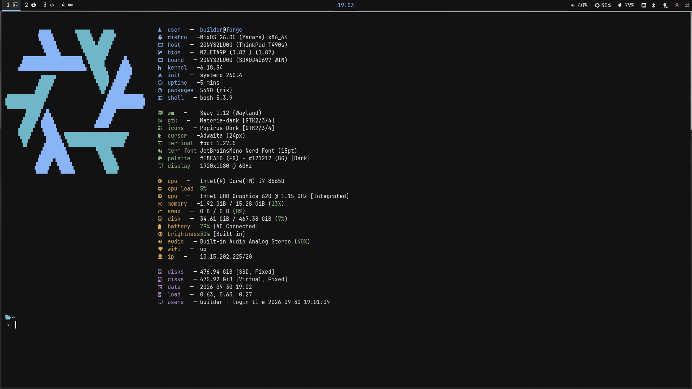

# NixOS Configuration

A modular NixOS system configuration for a development machine named "forge".

## Overview

This repository contains a complete NixOS system configuration with modular organization for easy maintenance and customization.



## System Information

- **Hostname**: forge
- **State Version**: 26.05
- **Timezone**: Europe/London
- **Locale**: en_GB.UTF-8

## Configuration Structure

The configuration is organized into the following modules:

- **`boot.nix`** - Boot and bootloader configuration
- **`desktop.nix`** - Desktop environment setup
- **`hardware.nix`** - Hardware-specific settings
- **`networking.nix`** - Network configuration
- **`packages.nix`** - System packages and software
- **`security.nix`** - Security settings and policies

## Features

- Flakes and new Nix CLI experimental features enabled
- Modular configuration structure for easy management
- Hardware-specific configurations
- Comprehensive package and security management

## Getting Started

To apply this configuration to your NixOS system:

```bash
nixos-rebuild switch -I nixos-config=./configuration.nix
```

## Files

- `configuration.nix` - Main system configuration
- `hardware-configuration.nix` - Hardware-specific settings
- `modules/` - Modular configuration files

---

Made with NixOS ❄️
